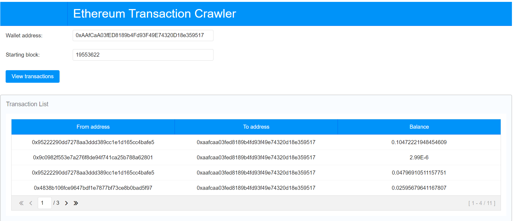

## Application ethereum-transactions-crawler

### Description:
Application that will allow a user to view transactions
data from the Ethereum blockchain associated with a specific
wallet address starting with block B.

#### Key features / place for improvements:
* application supports paging, sorting and selecting.
* current version doesn't support investigating different
  addresses. Choosen address is hardcoded - exception handling is not supported.

#### Demo:


##### **Prerequisites**:
```
* Maven 3.8.1
* Java 17
* Spring Boot 3
* ZK (9.6.0.1-jakarta-Eval)
```

### How to run
#### Compile
```
mvn clean install
```

#### Build image
```
mvn spring-boot:build-image
```

#### Start container in Docker environment
```
docker run -p 8080:8080 ethereum-transactions-crawler-1.0.1:latest
```

### Run application
Navigate to the `localhost:8080` in your browser
```
http://localhost:8080/
```

### Example:
In application it is choosen (fixed) specific address <b>0xAAfCaA03fED8189b4Fd93F49E74320D18e359517</b> from block <b>19553622</b> to the current block.